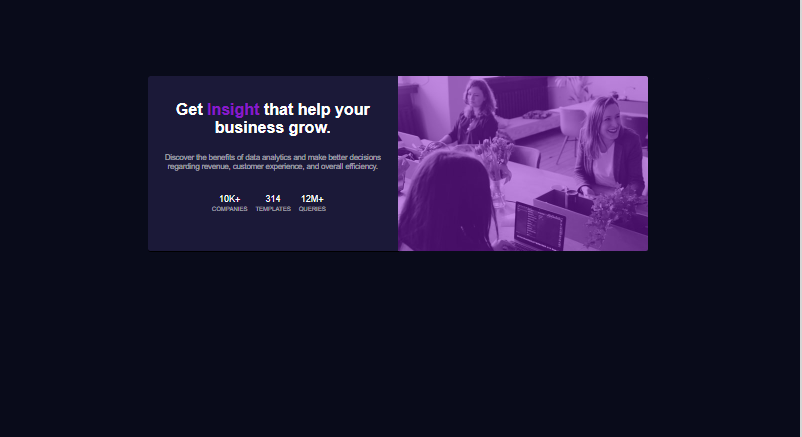

# Frontend Mentor - Stats preview card component solution

This is a solution to the [Stats preview card component challenge on Frontend Mentor](https://www.frontendmentor.io/challenges/stats-preview-card-component-8JqbgoU62). Frontend Mentor challenges help you improve your coding skills by building realistic projects. 

## Table of contents

- [Overview](#overview)
  - [The challenge](#the-challenge)
  - [Screenshot](#screenshot)
  - [Links](#links)
- [My process](#my-process)
  - [Built with](#built-with)
  - [What I learned](#what-i-learned)
  - [Continued development](#continued-development)
  - [Useful resources](#useful-resources)
- [Author](#author)


## Overview

### The challenge

Users should be able to:

- View the optimal layout depending on their device's screen size

### Screenshot




### Links

- Solution URL: [Add solution URL here](https://your-solution-url.com)
- Live Site URL: [Add live site URL here](https://your-live-site-url.com)

## My process

### Built with

- Semantic HTML5 markup
- CSS custom properties
- Flex
- CSS Grid
- Mobile-first workflow


### What I learned

i have learned new things and refresh my old knowledge specially on flex alignment and centering.

the new thing i have learned on this project is color overlay on background picture and i did that using css box-border


```css
.proud-of-this-css {
  box-shadow: inset 0 0 0 1000px rgba(137, 26, 201, 0.5);
}
```


### Continued development

i will continue improving myself on css specially on grid, layout and centering


### Useful resources

- [w3school](https://www.css-tricks.com) - This helped me for alots on solving flex centering. I really liked this pattern and will use it going forward.
- [google](https://www.colorpicker.com) - This is an amazing site which helped me select the color of the style. I'd recommend it to anyone.


## Author

- Frontend Mentor - (https://www.frontendmentor.io/profile/Abdullahi-dev)
- Github - (https://github.com/Ab-sow)


